# Court Reporting Workflow Manager

This is implementation of Court Reporting Workflow Manager

## Tech Stack

- Backend: Express 5, Prisma 7, JWT, Argon2
- Frontend: Next.js 16, React 19, Tailwind CSS 4, ShadCN
- Database: PosgreSQL

## Features

- Role-based auth (Reporter, Editor, Admin)
- Job Status (NEW -> ASSIGNED -> TRANSCRIBED -> REVIEWED -> COMPLETED)
- Transcription Versioning
- Payment Calculation
- User Avaibility

## Entity Relation Diagram (ERD)

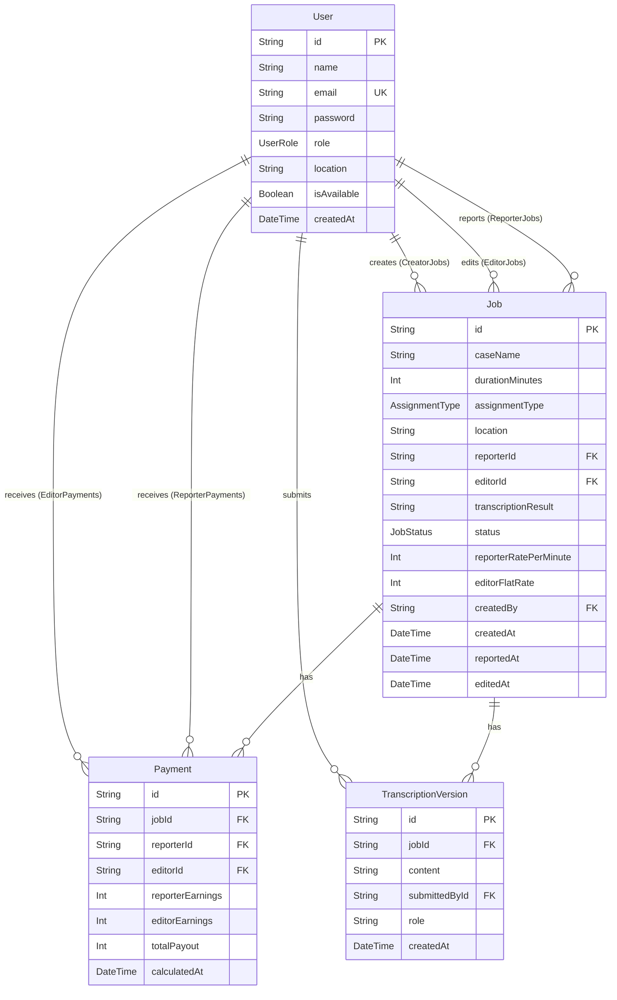

## How to run

### Prerequisites

- NodeJS, PostgreSQL

### Backend Setup

```bash
cd backend
npm install
cp .env.example .env
npm run db:migrate
npm run create-admin
npm run dev
```

### Frontend Setup

```bash
cd frontend
npm install
npm run dev
```

### API Endpoints

Base URL: `/api`

#### Auth & Users (`/api/user`)

| Method | Endpoint | Auth | Description |
|--------|----------|------|-------------|
| POST | `/user/login` | No | Login and get JWT token |
| POST | `/user` | Yes | Create a new user |
| GET | `/user` | Yes | List all users |
| GET | `/user/:id` | Yes | Get user by ID |
| PATCH | `/user/:id` | Yes | Update user |
| DELETE | `/user/:id` | Yes | Delete user |
| PATCH | `/user/:id/activate` | Yes | Activate user |
| PATCH | `/user/:id/deactivate` | Yes | Deactivate user |
| PATCH | `/user/me/availability` | Yes | Toggle current user availability |

#### Jobs (`/api/jobs`)

| Method | Endpoint | Auth | Description |
|--------|----------|------|-------------|
| GET | `/jobs/dashboard` | Yes | Get dashboard stats |
| GET | `/jobs` | Yes | List all jobs |
| GET | `/jobs/:id` | Yes | Get job by ID |
| POST | `/jobs` | Yes | Create a new job |
| PATCH | `/jobs/:id` | Yes | Update job |
| DELETE | `/jobs/:id` | Yes | Delete job |
| POST | `/jobs/:id/assign-reporter` | Yes | Assign reporter to job |
| POST | `/jobs/:id/assign-editor` | Yes | Assign editor to job |
| POST | `/jobs/:id/transcribe` | Yes | Submit transcription |
| POST | `/jobs/:id/review` | Yes | Submit review |
| POST | `/jobs/:id/complete` | Yes | Mark job as completed |

## Project Structure

```
backend/
├── app.ts                    # Express app entry point
├── controllers/              # controllers folder
├── services/                 # business logic
├── routes/                   # routes folder
├── middlewares/              # Middleware folder (auth, error handler)
├── prisma/                   # Prisma schema
├── scripts/                  # Scripts folder including for CLI
└── generated/
    └── prisma/               # Generated Prisma client including model

frontend/
├── app/
│   ├── layout.tsx            # Root layout
│   ├── auth/login/           # Login page
│   └── (dashboard)/
│       ├── page.tsx          # Dashboard home
│       ├── jobs/             # Jobs pages (list, new, [id])
│       └── users/            # Users pages (list, new, [id]/edit)
├── components/ui/            # ShadCN UI components
├── lib/
│   ├── api.ts                # API client
│   ├── auth-context.ts       # Auth context provider
│   ├── constants.ts          # App constants
│   └── utils.ts              # Utility functions
└── hooks/
    └── use-mobile.ts         # Mobile detection hook
```

## Assumptions / Design Decisions
I used next.js because it's one of open-source and popular web frontend development built on top of ReactJS which extending capability to load page quickly and SEO optimazation. For UI Component, i used tailwindcss and ShadCN for component UI. The theme i use is Maia style. For icons, i used hugeicons which one of the icons for the react developer. For backend, i used expressJS for simplicity with MVC pattern and utilizing prisma ORM to interact with database. For UI perspective, i tend to use minimalism, flat, modern with simple style. 

## Screenshots
| Login | Admin Dashboard |
|:---:|:---:|
| 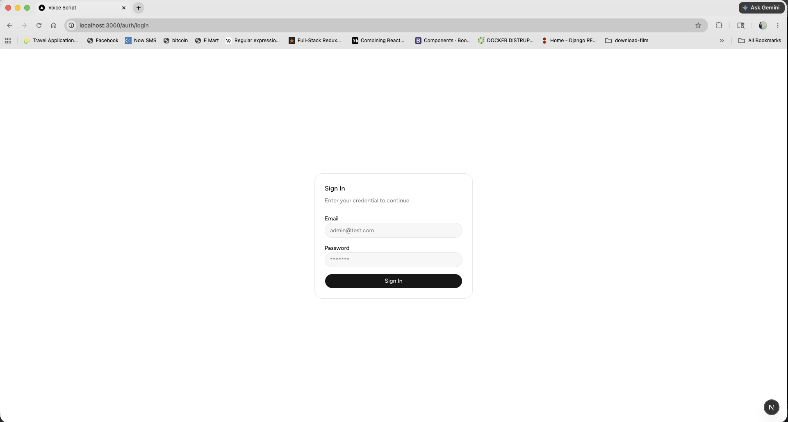 | 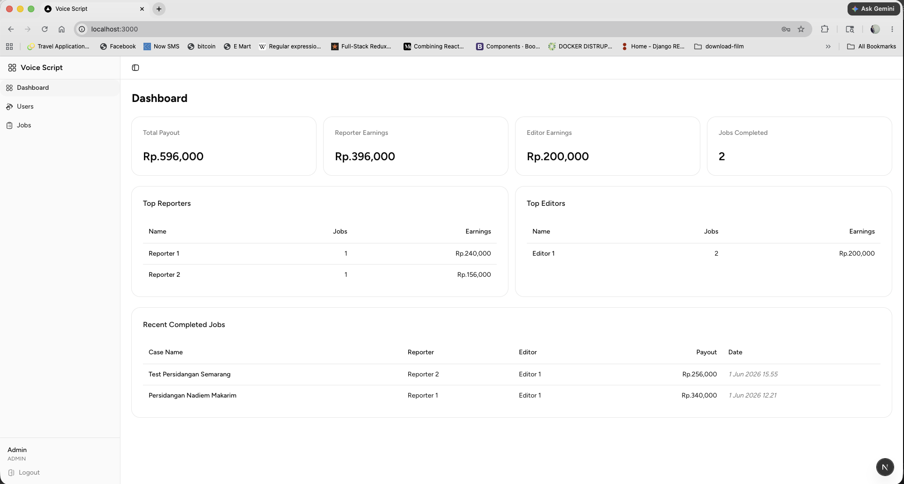 |
| User Table | Job Table |
|:---:|:---:|
| 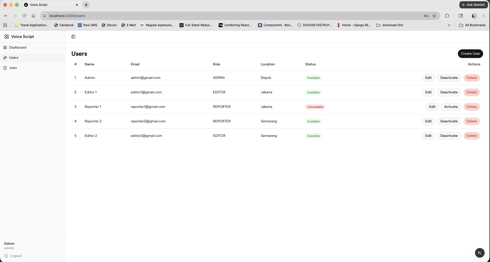 | 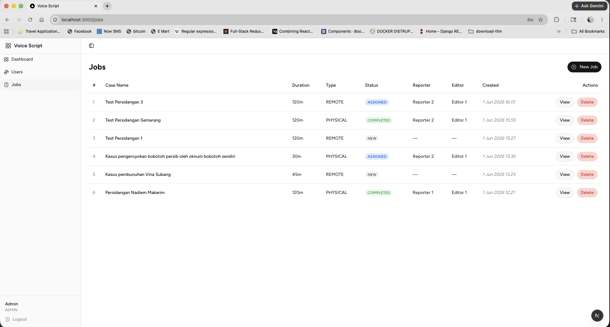 |
| Job Creation | Job Reporter & Editor Assignment |
|:---:|:---:|
| 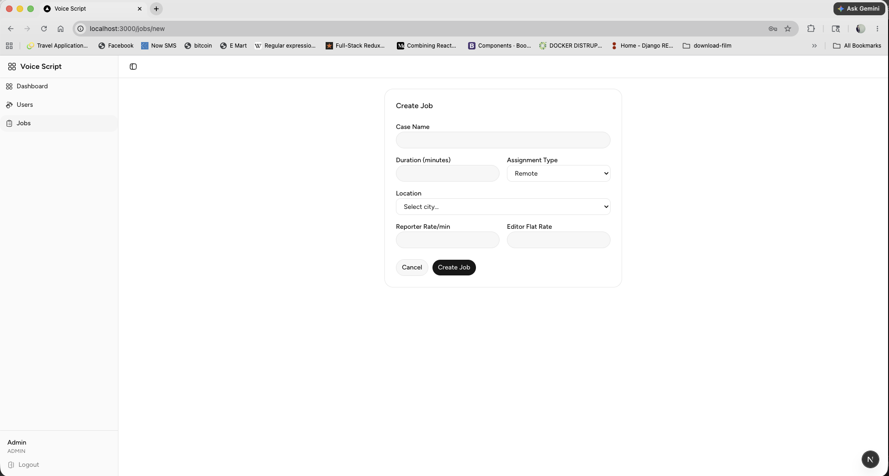 | 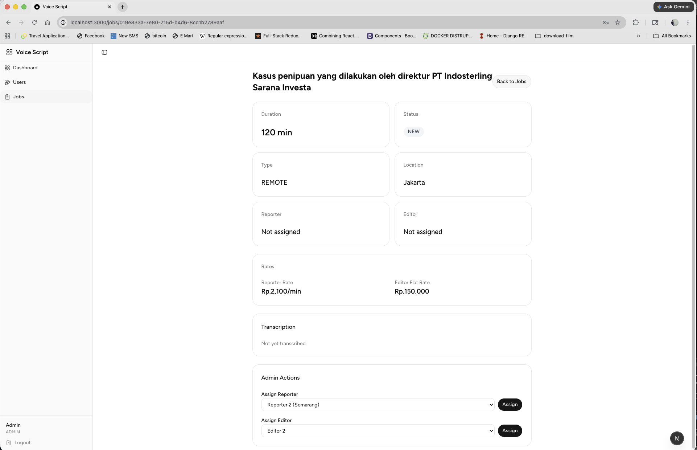 |
| Reporter Role View | Reporter Transcription Submit |
|:---:|:---:|
| 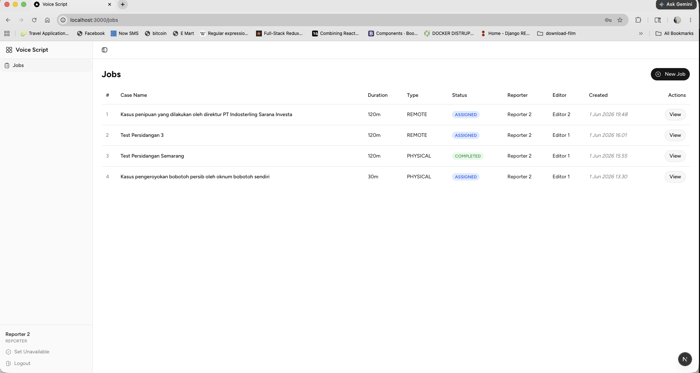 | 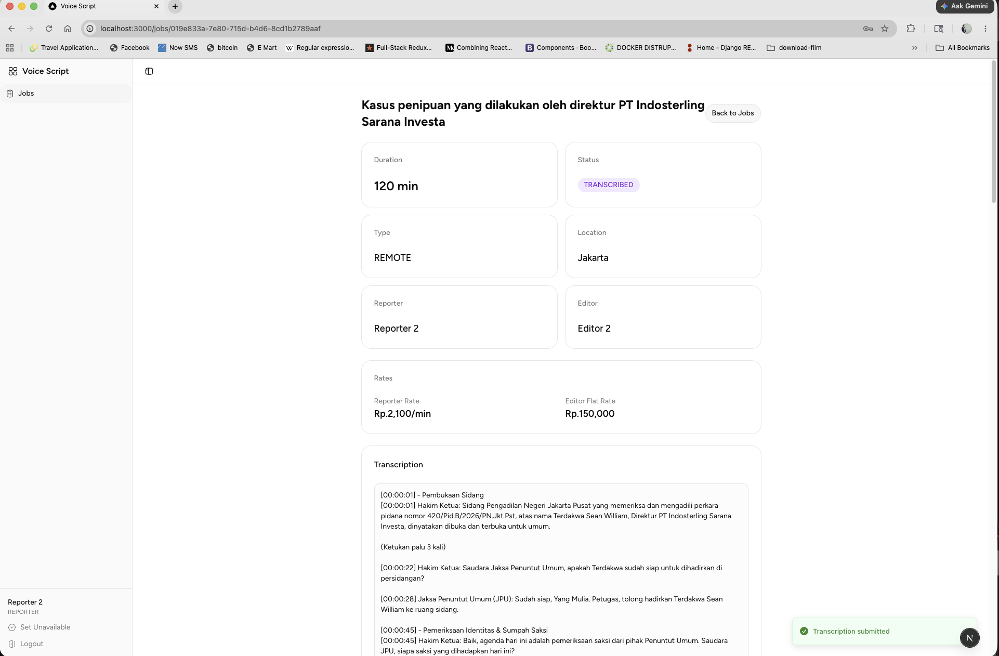 |
| Editor Editing | Admin Complete Job |
|:---:|:---:|
| 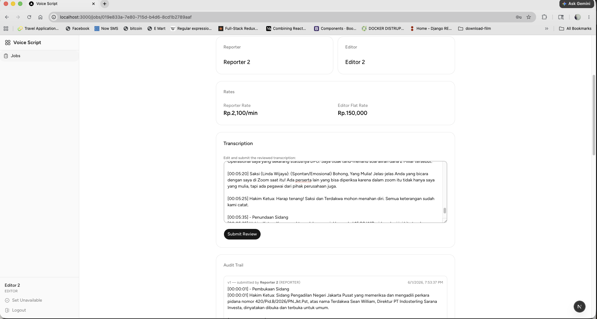 | 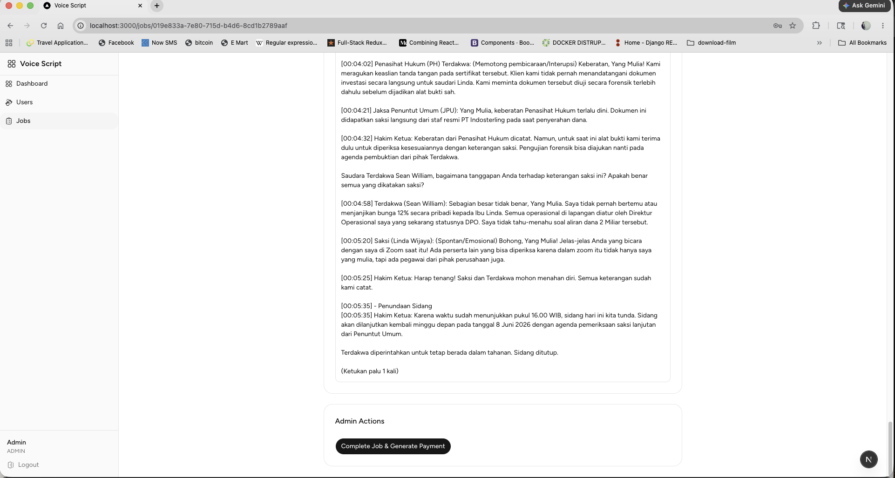 |